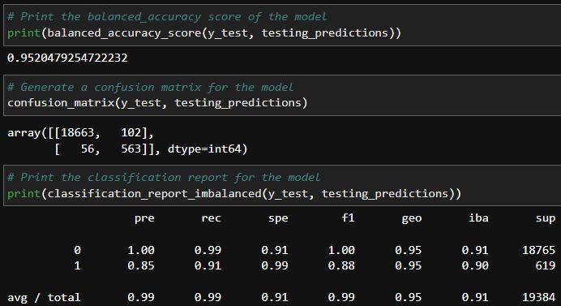
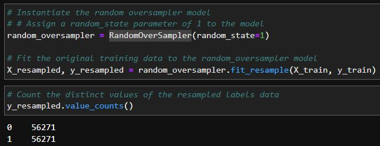
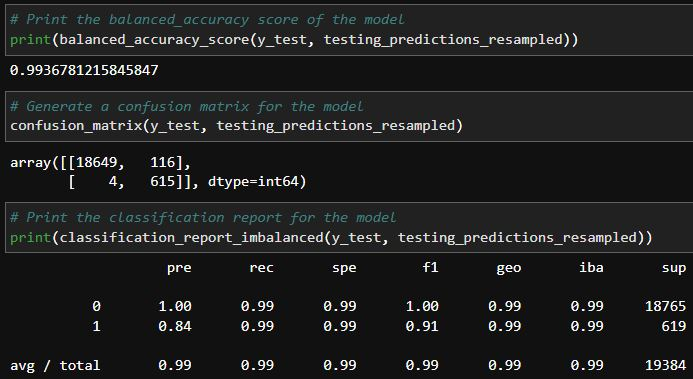

Module 12 Challenge

In this project, two logistic regression models are built to determine healthy loans vs high-risk loans.  The second model is resampled to adjust for 
imbalancing.  Confusion matrixes and classification reports are produced from both models.

---


## Technologies


This project uses Python 3.9.7 and the following libraries - 


| Library | Version | Documentation
|----|----|---|
| pandas |1.4.2| [pandas docs](https://pandas.pydata.org/docs)
| scikit-learn |1.1.1| [scikit-learn docs](https://scikit-learn.org/stable/)
| imbalanced-learn | 0.9.1 | [imblearn docs](https://imbalanced-learn.org/stable/)

---


## Installation Guide


```
pip install -U scikit-learn

conda install -c conda-forge imbalanced-learn
```


---


## Usage


Matrixes and reports are used in evaluating the models.  The data for the second model it resampled.


|<p align="center">Original Data Report</p>|
|---|
|<p align="center"></p>|
|<p align="center">**Resampling Data**</p>|
|<p align="center">|
|<p align="center">**Resampled Data Report**</p>|
|<p align="center">|
---


## Contributors

Dan McQueen

dandmcqueen@gmail.com

[Linkedin](https://www.linkedin.com/in/dan-mcqueen-4a5980238/)

---


## License

[GNU v3.0](LICENSE)
